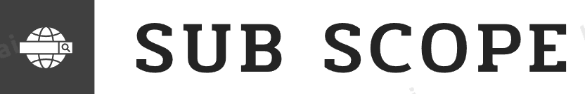

  

# SubScope

SubScope is a powerful subdomain enumeration tool designed to help security professionals discover subdomains associated with a target domain. It leverages various subdomain discovery techniques and tools to provide comprehensive results.

## Features

- Subdomain enumeration using multiple methods:
  - Web Archive
  - CRT.SH
  - AbuseIPDB
  - DNS Bufferover
  - Findomain
  - Subfinder
  - Amass
  - Assetfinder
- Simple installation process
- Easy-to-use command-line interface
- Fast and efficient subdomain discovery

## Installation

To install SubScope, simply run the provided installer script:

\`\`\`bash
./install.sh
\`\`\`

The installer script will check for and install any required dependencies. After installation, you can use the \`subscope\` command to run the tool.

## Usage

To enumerate subdomains for a target domain, use the following command:

\`\`\`bash
subscope -d example.com
\`\`\`

Replace \`example.com\` with your target domain. This command will initiate subdomain enumeration using various techniques and display the results.

## Requirements

SubScope relies on the following tools for subdomain enumeration:

- curl
- awk
- sort
- tr
- grep
- sed
- findomain
- subfinder
- amass
- assetfinder

These tools are automatically installed during the SubScope installation process.

## License

This project is licensed under the [MIT License](LICENSE).

## Contributing

Contributions are welcome! If you'd like to contribute to SubScope, please fork the repository, make your changes, and submit a pull request. For major changes, please open an issue first to discuss the proposed changes.

## Credits

SubScope is developed and maintained by [Your Name].

## Contact

For any questions or inquiries, please contact [Your Email Address].
EOF
